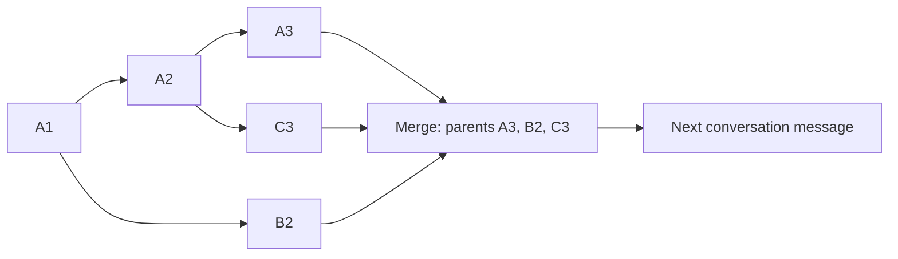

# Conversation graph merge

`codex merge A_ID B_ID C_ID` combines conversation context into a new resumable
Codex thread. It works for discussion, writing, research, planning, and coding.
The first source is the primary conversation. Sources remain unchanged.

```sh
# Preview without model calls, archive writes, or a target conversation
./codex merge A_ID B_ID C_ID --dry-run

# Merge, then continue the saved conversation
./codex merge A_ID B_ID C_ID --name "Combined discussion" --resume

# Also ask Codex for a narrative comparing the branches
./codex merge A_ID B_ID C_ID --semantic \
  --goal "Compare the candidates while preserving disagreements"
```

Use session UUIDs, not Git branch names. In this source checkout, `./codex`
selects the modified npm launcher. This implementation uses existing app-server
APIs; native `thread/merge`, Desktop buttons, and Git working-tree merges are
outside its current interface.

## Interactive CLI

After building this branch's native CLI, start `./codex` and enter `/merge`.
The current chat is the primary. Search saved chats, select branches with Space,
and confirm with Enter; Esc closes the picker. Success opens the new merged chat
through the existing resume flow.

```text
/merge B_ID C_ID
/merge --semantic
/merge B_ID C_ID --mode summary --semantic --goal "Compare the candidates"
/merge B_ID C_ID --dry-run
/merge --help
```

Options without branch IDs open the picker and carry those options into the
merge. The engine, graph evidence, context planning, and modes are shared with the
external command. Esc or Ctrl+C during analysis cancels it and keeps the current
chat. Failures also keep the current chat. Sources must be local, saved, and idle,
and the primary must be writable. The slash command inherits the current
connection and analysis model; `--resume`, `--cd`, `--config`, and `--json` are
external-command options.

The native TUI routes a Node helper's namespaced JSON-RPC over its own app-server
connection, so it does not acquire a second writer for the current conversation.
Hidden analysis streams are delivered to the helper, while other server events
retain normal TUI routing. Cancellation and helper failures interrupt and release
helper-owned threads. Node must be available alongside the native CLI; the npm
launcher supplies the helper path and Node executable.

Build and launcher instructions are in [context_merge_checkout.md](context_merge_checkout.md).

## The stored graph and the model's context

Consider a primary `A1 → A2 → A3`, a branch `A1 → B2`, and a branch
`A1 → A2 → C3`. The archive retains this graph:



`B2` remains a child of `A1`; `C3` remains a child of `A2`. Their arrival order
at merge time does not imply that either branch had seen the other. The merge
node has an explicit primary parent and all source heads as parents.

The durable archive contains two related structures:

- Original records retain JSON text, attribution, fingerprints, and attachments.
- Graph nodes retain stable identities, parent links, tool correlations, and
  branch paths/heads. Merge nodes link histories without rewriting old parents.

A whole user or assistant message is one node. Attachments stay with that message.
A tool call and its result are separate nodes; results link to the matching call
within their historical branch. Turn groups are metadata for reading, not node
boundaries. Splitting a large message for analysis or retrieval keeps its node ID.

A native fork reuses its ancestor prefix. The graph is reconstructed when merging
from saved fork metadata and exact shared history; it does not require an eagerly
written graph for every ordinary native turn. Copied legacy prefixes are
canonicalized to the same original nodes. Unrelated or unidentifiable ancestry is
labelled `unknown`; the model is not asked to invent a fork point.

The model still receives a linear input. Its added user message quotes a graph
view containing branch heads, fork points, ancestry, and one of three presentations:
original nodes, a narrative summary, or an archive reference. Thus short branches
are embedded without flattening them into new mainline conversation turns.

## Presentation modes

| Mode             | Behavior                                                                                                                     |
| ---------------- | ---------------------------------------------------------------------------------------------------------------------------- |
| `auto` (default) | Inline originals that fit; summarize larger selections; use references when the analysis/context budget cannot fit a summary |
| `inline`         | Require all selected originals to fit; fail before model calls if they do not                                                |
| `summary`        | Require narrative summaries of nonempty selected branches, even when originals are short                                     |
| `reference`      | Keep branch metadata and original-node references; never call a model                                                        |
| `legacy`         | Compatibility mode for the earlier flat context merger; `--semantic` selects its earlier task-state format                   |

Auto mode can call Codex to compress long material. Optional `--semantic` adds a
cross-branch narrative after the structural view, preserving attribution,
corrections, uncertainty, and open disagreements. It uses `{text, refs}` rather
than a fixed completed/pending/next-actions template. It is incompatible with
reference mode. `--goal` focuses this optional reading and requires `--semantic`.

The analysis model defaults to the configured Codex model; `--model` overrides it.
Existing login/provider configuration is used and normal inference usage applies.
Short inline merges and reference merges need no inference. Dry runs never call a
model and report which presentations and analysis would be needed.

## Budgets and long conversations

| Option                   | Behavior or default                                                              |
| ------------------------ | -------------------------------------------------------------------------------- |
| `--context-tokens N`     | Whole-context planning ceiling; clamped to a known model window                  |
| `--reserve-tokens N`     | Reserve for instructions, new input, and output; 4,096                           |
| `--max-bytes N`          | Maximum serialized added context, including inline images; 524,288 bytes         |
| `--summary-bytes N`      | Upper bound per reading; 16,384 bytes, further reduced to fit                    |
| `--max-input-bytes N`    | Upper bound per serialized analysis input; 524,288 bytes, further reduced to fit |
| `--timeout-seconds N`    | Deadline for each analysis turn; 600 seconds                                     |
| `--evidence-dir DIR`     | Override the original archive directory                                          |
| `--name TEXT`            | Name the new conversation                                                        |
| `--dry-run`              | Read and validate sources; create neither archive nor target                     |
| `--json`                 | Print a structured result                                                        |
| `--resume`               | Open the saved conversation                                                      |
| `-C DIR`, `--cd DIR`     | Target working directory                                                         |
| `-c K=V`, `--config K=V` | Repeatable native Codex configuration override                                   |

Planning includes the primary history and added context. It uses saved native
input/output token usage when available, plus a conservative UTF-8 byte estimate
for later records. Otherwise it uses the byte estimate for all text. The effective
window comes from native usage or configuration, or a 32,768-token planning
default when neither is known. The JSON result reports the chosen window,
reserve, occupancy estimate, and their source.

These estimates are not an exact provider tokenizer, particularly for images and
hidden instructions. The reserve provides headroom; the provider still enforces
its actual limits. Raising `--max-bytes` alone does not raise the context window.
The native target's usual instructions/tools remain subject to its configuration.

If even minimal branch metadata plus the primary history exceed the budget, auto
mode creates a fresh native conversation with a compact primary view. The complete
primary and branch originals remain in the archive. This avoids copying an
already oversized primary into the target. Explicit inline mode fails when full
originals cannot fit; forced summary mode also fails if its analysis cannot fit.

Compression divides original JSON into UTF-8 fragments, keeping node IDs and byte
ranges, then summarizes each bounded chunk. Intermediate reductions combine
bounded readings until a final reading fits. Every analysis uses a fresh
isolated ephemeral thread, so input does not accumulate between chunks. Analysis
inputs are capped at 24,576 bytes or a smaller effective budget; normal branch
readings are capped at 1,536 bytes and can shrink further. The optional cross-branch
reading is capped at 2,048 bytes. A supplied lower option takes precedence.

Encoded images are omitted from the text-only summary input and explicitly
labelled as uninspected. Inline views attach images as native image inputs.
Summarized/reference views retain original attachments in the archive for later
inspection; the summary does not claim to understand those images.

Summaries cite original nodes and carry a coverage range/count and source hash.
Those describe the material supplied to analysis, not proof that every fact or
clause survived compression. Unknown references, invalid output, model failures,
and actual budget overruns stop the merge before a final target is created.
Auto mode does not conceal invalid model output by switching to references.

## Reading originals and inspecting ancestry

Archives default to `${CODEX_HOME:-~/.codex}/merges/evidence/`. Each filename is the
SHA-256 checksum of its contents. Exclusive writes and hash checks preserve each
snapshot's identity; original JSON strings preserve numeric literals and escapes.
Archive/rollout files are capped at 64 MiB. The archive includes a
`codex-conversation-graph-v1` graph inside `codex-merge-evidence-v1`.

The saved context supplies an archive location and a bounded lookup command.
These commands read local data without starting the native app-server or a model:

```sh
# Overview, exact DAG, or a small Mermaid diagram
./codex merge graph /path/to/HASH.json
./codex merge graph /path/to/HASH.json --json
./codex merge graph /path/to/HASH.json --mermaid
./codex merge graph /path/to/HASH.json --node m_MERGE_NODE

# Paginated index of original nodes
./codex merge evidence /path/to/HASH.json --limit 10 --max-tokens 2048

# Branch material after its fork point; the output provides nextOffset
./codex merge evidence /path/to/HASH.json --branch B_ID \
  --offset 0 --limit 5 --max-tokens 2048 --json

# Exact original record
./codex merge evidence /path/to/HASH.json r_NODE_ID --json

# A large node: read byte ranges, then continue from the returned nextByte
./codex merge evidence /path/to/HASH.json r_NODE_ID \
  --start-byte 0 --length-bytes 512 --max-tokens 2048 --json
```

Output defaults to a 64 KiB byte limit. `--max-tokens` applies a conservative byte
bound, not an exact tokenizer count. Index/branch pages shrink to fit and return
`nextOffset`; complete single records are never silently shortened. If one record
exceeds the limit, request an explicit byte range. Byte ranges must start on a
UTF-8 character boundary and return `nextByte`. Graph reads support `--node` and
output limits; a node-filtered Mermaid view shows its ancestors.

Keep the archives available. Missing or changed originals cause later merges to
fail. Paths are local absolute paths; moving conversations between machines
requires preserving or adapting those locations. Local summaries are cached
beside the evidence directory under `summaries/`, keyed by original input,
instructions, effective model/provider/effort, and output budget. Cache integrity
and original references are checked on reuse.

## Repeated merges and consistency

Later merges expand prior graph views into their originals and stored ancestry.
Earlier flat/semantic merges can also be imported, with their less precise
ancestry marked as legacy. Supplying their original branch snapshots during the
first conversion lets the compiler resolve provisional ancestry before saving
the graph. Already saved graph parents remain immutable. Old summaries are not
treated as new source evidence.
Cached readings of unchanged original chunks can be reused; changed chunks are
read again.

If the latest graph already includes all requested unchanged branch heads,
default auto mode reuses the merge node and its context with zero inference and
no duplicate graph frame. Continuing a branch adds only its new nodes, retains
all old parent links, and creates a new merge node. Messages written after a
merge parent that merge node, including when a merged conversation is forked.

Sources must be 2–32 distinct, local, persisted, idle conversations. Legacy and
paginated histories are supported. Saved parent byte/ordinal bounds prevent a
fork from accidentally inheriting later changes to its parent. Rollbacks trim
input boundaries, including steering inputs in one turn. Full replacement
compaction checkpoints replace visible history. Compressed rollouts require
Node.js 22.15 or later with zstd support.

Rollback after compaction and some older media/oversized-text compactions need
native canonical replay and are rejected. Private reasoning and authorization
state are excluded. Reference/provenance nesting is limited to 64 entries. An
archive captures retained source history; it does not recover records already
removed by native compaction or rollback.

Sources are checked for incomplete records, unfinished turns, cycles, identity
mismatches, and changes during reads. After analysis, the primary is re-read and
compared before injection. This is a collection of individual snapshots, not a
global transaction across all source writers. Known incomplete targets are
archived if persistence or race validation fails.

Native fork interruption notices are fingerprinted as merge annotations only
when added to an unchanged source. They remain in native history and do not become
new original branch evidence on a later merge. Real user interruptions remain
source evidence.

Readers use instructions that distinguish quoted historical requests from live
instructions, retain each branch's scope, and forbid executing historical tool
calls. Analysis disables shell, browsing, apps, MCP, agents, hooks, and memory/skill
discovery. The compiler validates DAG integrity, original citations, shapes,
checksums, and budgets; it cannot prove the semantic accuracy of a reading.

The CLI closes its private app-server before returning or starting `resume`.
Applications using a long-lived connection own its lifecycle and should continue
through that connection or release it before an independent frontend resumes.

## JavaScript interface and tests

```js
import { mergeThreads } from "./codex-cli/bin/merge-context.js";

const result = await mergeThreads(client, {
  threadIds: [aId, bId, cId],
  mode: "auto",
  contextTokens: 32768,
  reserveTokens: 4096,
  name: "Combined discussion",
});
```

The client needs `request(method, params)`. Compression/semantic reading also
needs `runTurn(params, { timeoutMs, maxOutputBytes })` returning `{text}` from
native turn notifications. `AppServerClient` in `merge-rpc.js` implements both.
Its optional `env` determines the default evidence location.

Graph results include `threadId`, original-record import/skip counts,
`mergeNodeId`, `graphNodes`, `reusedGraph`, `presentations`, `primaryEmbedded`,
`evidence`, context size/hash, budget estimates, and model/cache usage. Optional
fusion adds `reading`. Dry-run evidence/hash are null and planned presentations
are estimates; models may still fail or exceed their output limits during execution.

```sh
CODEX_MERGE_TEST_BINARY=/path/to/native/codex \
  node --test --test-reporter=spec codex-cli/tests/*.test.js
```

Unit and controlled native integration tests require no live model credentials.
Without `CODEX_MERGE_TEST_BINARY`, native tests are skipped. The controlled
Responses fixtures check native persistence and protocol behavior; a separate
real-model example checks one generic writing discussion. See [validation](../VALIDATION.md)
and [checkout instructions](context_merge_checkout.md).

`CODEX_TUI_MERGE_TEST_BINARY` separately enables the Unix terminal integration
test for this branch's compiled `/merge` implementation. It requires Python 3
and checks the picker, help, previews, automatic switching, model-visible branch
content, semantic reading, cancellation, and unchanged source context.
